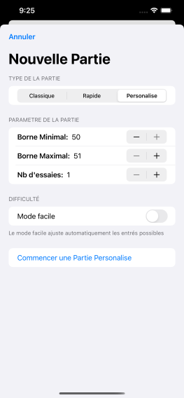
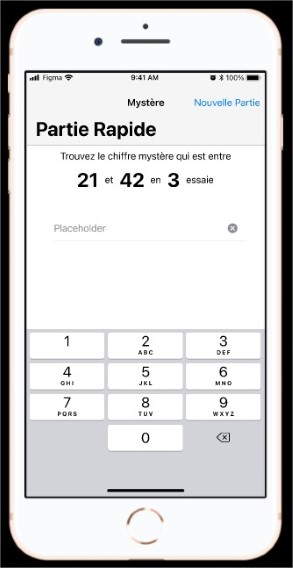
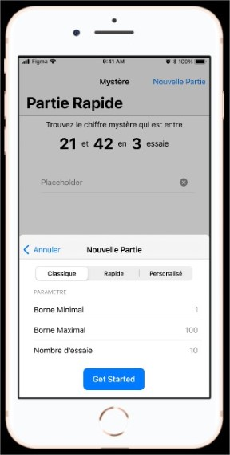
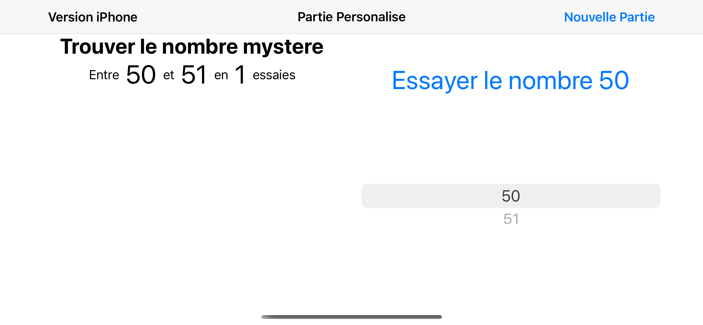
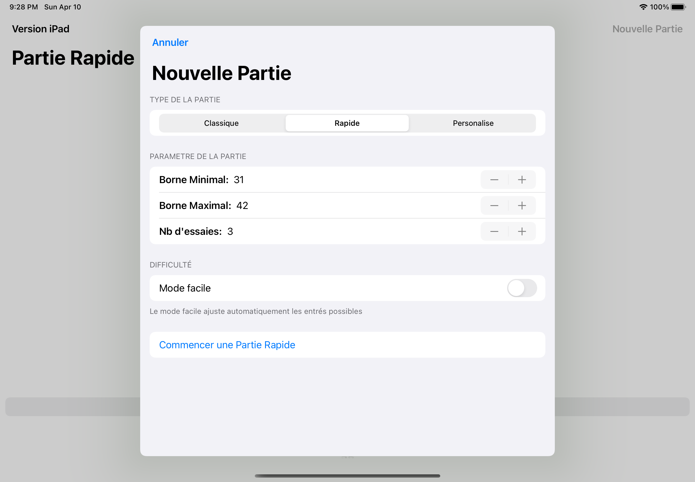

# Le modèle MCV - iOS1 - Laboratoire 3 [AEC-420-290]

## Comment utiliser l'application
L'utilisation de l'application est facilité par l'utilisation des lignes directrice de l'interface humain (Human Interface Guideline) d'Apple

### 1. Nouvelle partie
En premier, vous devez choisir le type de partie. Pour certain type, vous pouvez modifier les parametres.

Si les parametres ne sont pas modifiable, le controle `Stepper` est déactiver.
De plus, ce controle ne permet pas que la **Borne Minimal** soit égale ou plus grand que la **Borne Maximal**

Pour chacune des types de parties, vous pouvez activer le *Mode Facile*. Ce mode ajuste automatiquement les entrés possible.

Les parametres de partie sont modifiable dans le fichier JSON dans le répertoire `ressources`. S'il y a plus que 3 types de parties possible, le type de `Picker` est modifier.

Pour commencer une partie, appuyer sur le bouton `Commencer une Partie ...`

### 2. Jouer une partie
Lorsque vous jouez une partie, vous essayé un nombre en le choisissant sur le `WheelPicker` et en appuyant sur le bouton `Essayer le nombre ##`

**ATTENTION** La selection du nombre ce fait lorsque le `WheelPicker` arrete de tourner. Assurez vous que ce soit le bon nombre qui soit afficher sur le bouton.

Après avoir fait un essaye, un pastille de résultat s'affichera. Portez attention à la fleche verte, elle vous indiquera si le nombre rechercher est plus bas ou plus haut que le nombre de votre essais.

Si vous êtes en mode facile, les choix du `WheelPicker` changerons pour les nombres restant possible. 

Lorsque la partie est terminé, un écran de résultat s'affichera. Pour faire une nouvelle partie, appuyer sur le bouton `Nouvelle Partie` en hau à droite.

Vous pouvez appuyer sur le bouton `Nouvelle Partie` en tout temps. Pour revenir à la partie en cours, appuyer sur le bouton `Annuler` ou *Swipe Down* l'écran. Si vous appuyer sur `Commencer une Partie ...`, la partie en cours sera annuler.

## Nouveau Design
.png) 

.png) .png)

## Changement dans le design graphique initiale
L'intention du design initiale était d'utiliser le Human Interface Guideline d'Apple et cela est resté.

Les principales changement concerne les methodes d'entré de l'utilisateur. Ces changement sont survenue en regardant les controles offert par Apple.

Un autre changement est le visuel des essaies. Ce changement à eu lieu car le design initiale était temporaire et pas adapter à son intégration.

## Design Initiale
 

## Autre Capture d'écran
### Icone
.png)
### Launch Screen
.png)
### Reactive (Paysage)

### Reactive (iPad)

